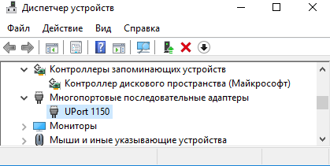
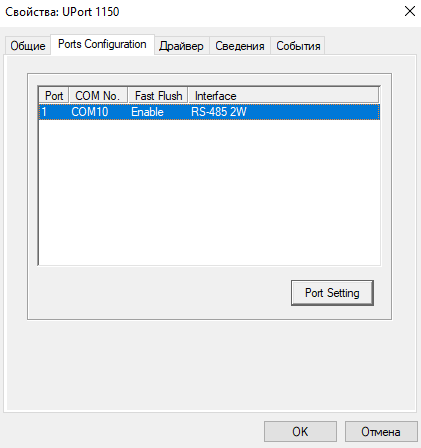
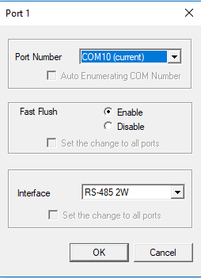
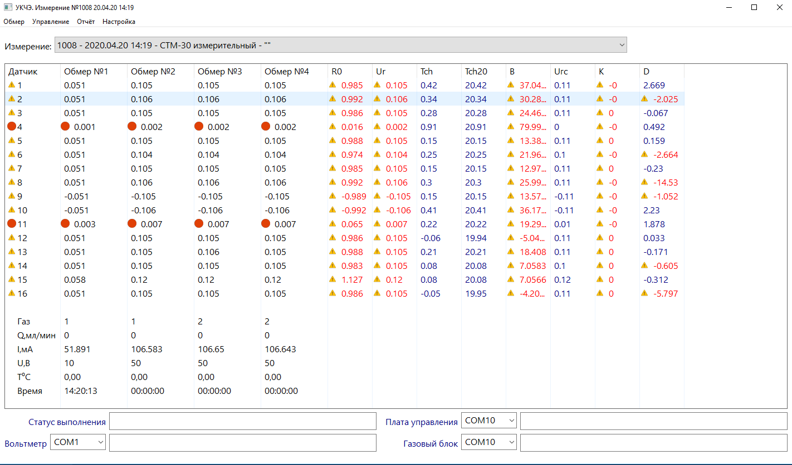
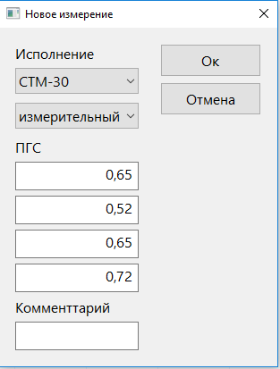

- [Установка контроля чувствительных элементов.](#%d0%a3%d1%81%d1%82%d0%b0%d0%bd%d0%be%d0%b2%d0%ba%d0%b0-%d0%ba%d0%be%d0%bd%d1%82%d1%80%d0%be%d0%bb%d1%8f-%d1%87%d1%83%d0%b2%d1%81%d1%82%d0%b2%d0%b8%d1%82%d0%b5%d0%bb%d1%8c%d0%bd%d1%8b%d1%85-%d1%8d%d0%bb%d0%b5%d0%bc%d0%b5%d0%bd%d1%82%d0%be%d0%b2)
  - [Системные требования.](#%d0%a1%d0%b8%d1%81%d1%82%d0%b5%d0%bc%d0%bd%d1%8b%d0%b5-%d1%82%d1%80%d0%b5%d0%b1%d0%be%d0%b2%d0%b0%d0%bd%d0%b8%d1%8f)
  - [Структура и расположение ПО](#%d0%a1%d1%82%d1%80%d1%83%d0%ba%d1%82%d1%83%d1%80%d0%b0-%d0%b8-%d1%80%d0%b0%d1%81%d0%bf%d0%be%d0%bb%d0%be%d0%b6%d0%b5%d0%bd%d0%b8%d0%b5-%d0%9f%d0%9e)
  - [Работа с ПО](#%d0%a0%d0%b0%d0%b1%d0%be%d1%82%d0%b0-%d1%81-%d0%9f%d0%9e)
    - [Подготовка к работе](#%d0%9f%d0%be%d0%b4%d0%b3%d0%be%d1%82%d0%be%d0%b2%d0%ba%d0%b0-%d0%ba-%d1%80%d0%b0%d0%b1%d0%be%d1%82%d0%b5)
    - [Главное окно программы](#%d0%93%d0%bb%d0%b0%d0%b2%d0%bd%d0%be%d0%b5-%d0%be%d0%ba%d0%bd%d0%be-%d0%bf%d1%80%d0%be%d0%b3%d1%80%d0%b0%d0%bc%d0%bc%d1%8b)
    - [Таблица результатов обмера](#%d0%a2%d0%b0%d0%b1%d0%bb%d0%b8%d1%86%d0%b0-%d1%80%d0%b5%d0%b7%d1%83%d0%bb%d1%8c%d1%82%d0%b0%d1%82%d0%be%d0%b2-%d0%be%d0%b1%d0%bc%d0%b5%d1%80%d0%b0)
    - [Подготовка обмера](#%d0%9f%d0%be%d0%b4%d0%b3%d0%be%d1%82%d0%be%d0%b2%d0%ba%d0%b0-%d0%be%d0%b1%d0%bc%d0%b5%d1%80%d0%b0)
    - [Выполнение обмера](#%d0%92%d1%8b%d0%bf%d0%be%d0%bb%d0%bd%d0%b5%d0%bd%d0%b8%d0%b5-%d0%be%d0%b1%d0%bc%d0%b5%d1%80%d0%b0)

# Установка контроля чувствительных элементов. 

Программное обеспечение (ПО) предназначено для настройки чувствительных элементов (ЧЭ) в лаборатории №74. 
ПО представляет собой приложение Win32 для персональных компьютеров (ПК) и рабочих станций. 

## Системные требования. 

* **Windows 7** или более поздняя версия 32-разрядной (x86) или 64-разрядной (x64) ОС семейства Windows NT. 

* **ПО не работает на ОС Windows XP**.

* 32-разрядный (x86) или 64-разрядный (x64) процессор с тактовой частотой 1 ГГц или выше.

* 1 ГБ (для 32-разрядного процессора) или 2 ГБ (для 64-разрядного процессора) ОЗУ.

* 50 ГБ (для 32-разрядной системы) или 100 ГБ (для 64-разрядной системы) свободного места на жестком диске.

* Графическое устройство DirectX 9 с драйвером WDDM 1.0 или более поздней версии.

* Для просмотра и печати отчётов необходим установленный **Adobe Acrobat Reader**

* Локальное расположение ПО необходимо внести в список исключений используемого антивируса.

* Текущий пользователь ОС должен иметь права доступа на чтение и запись.

## Структура и расположение ПО 

* Последняя версия ПО находится в сетевом расположении **\\a\a\OGM-SOFT\sensel** Для использования ПО на локальном ПК необходимо скопировать этот сетевой каталог в произвольное локальное расположение, для которого 

* Исполняемый модуль ПО: **sensel.exe**  Все расположения и пути к локальным файлам здесь и далее указаны относительно каталога исполняемого модуля.

* После запуска исполняемого модуля ПО создаёт файл **sensel.sqlite** при его отсутствии, в котором сохраняются все результаты обмеров ЧЭ, выполняемых ПО. 

* Технологический процесс обмера и параметры исполнений ЧЭ, используемые в ПО, разработаны инженерами лаборатории №74 и записаны в файле **lua/sensel.lua** Данный файл представляет собой скрипт на языке Lua, вызываемый ПО в процессе обмера ЧЭ.

* Для переноса ПО на другой ПК или в другое расположение необходимо дополнительно скопировать следующие файлы с сохранением расположения относительно исполняемого модуля ПО: 
    * **sensel.sqlite** (в том случае, если он содержит данные, представляющие ценность)
    * **lua/sensel.lua**

* ПО формирует отчёты в формате *pdf*. Отчёты помещаются в каталог **pdf**. Перед созданием отчёта ПО удаляет всё содержимое данного каталога. Поэтому для сохранения файла отчёта необходимо сделать это в **Adobe Acrobat Reader**. 

## Работа с ПО

### Подготовка к работе

Перед тем, как запустить **sensel.exe** и приступить к обмеру ЧЭ, необходимо правильно указать параметры исполнений в файле **lua/sensel.lua**. В противном случае ПО либо выдаст сообщение об ошибке при запуске, либо будет работать не корректно.

Для связи с оборудованием ПО использует два последовательных порта RS-485 и один порт RS-232.

Для обеспечения связи с оборудованием через USB следует использовать универсальный преобразователь USB-COM, однопортовый конвертер **MOXA UPort 1110**. 
Необходимо установить драйвера для данного конвертора и указать параметры интерфейса в настройках драйвера для каждого из портов:
* в настройках Windows выбрать: диспетчер устройств, многопортовые последовательные адаптеры, UPort 1150. Во вкладке **Port Configurations** нажать кнопку **Port Settings**

  
* в диалоговом окне **Port ...** указать: 
    * Fast Flush - Disabled 
    * тип интерфейса устройства, подключенного к данному последовательному порту, согласно таблице:
    
Устройство | Скорость, бод | Интерфейс
--- | --- | ---
Плата управления | 9600 | RS-485 2W
Газовый блок | 9600  | RS-485 2W
Вольтметр | 115200 | RS-232

### Главное окно программы

После запуска **sensel.exe** пользователь ПК может управлять работой ПО в главном окне программы. Основными элементами управления являются: 
* главное меню программы
* выпадающий список для выбора обмера  
* таблица результатов обмера 
* информационные сообщения статуса

### Таблица результатов обмера

Таблица содержит измеренные напряжения ЧЭ (колонки "Обмер №...") и рассчитанные параметры ЧЭ согласно указанному исполнению ЧЭ. Красный кружок в колонке "Датчик" означает, что в процессе обмера ПО обнаружило обрыв данного ЧЭ.   

### Подготовка обмера

Перед выполнением обмера необходимо: 
* подготовить и подключить планку ЧЭ к стенду
* подключить стенд, вольтметр и газовый блок согласно паспорту на стенд
* указать СОМ порты оборудования в соответствующих выпадающих в нижней части главного окна   
* выбрать пункт меню **Управление** - **Проверка связи**. ПО выполнит проверку связи с оборудованием и сообщит о результатах проверки в модальном диалоговом окне. В случае ошибки связи необходимо принять меры для её устранения.     
* выбрать пункт меню **Обмер** 

* в появившемся диалоговом окне указать параметры обмера:
    * в выпадающих списках указать исполнение ЧЭ
    * ввести значения концентрации поверочных газовых смесей (ПГС) с баллонов
    * при необходимости ввести текст комментария обмера. 
    * после нажатия кнопки **Ok** начнётся обмер. 

### Выполнение обмера